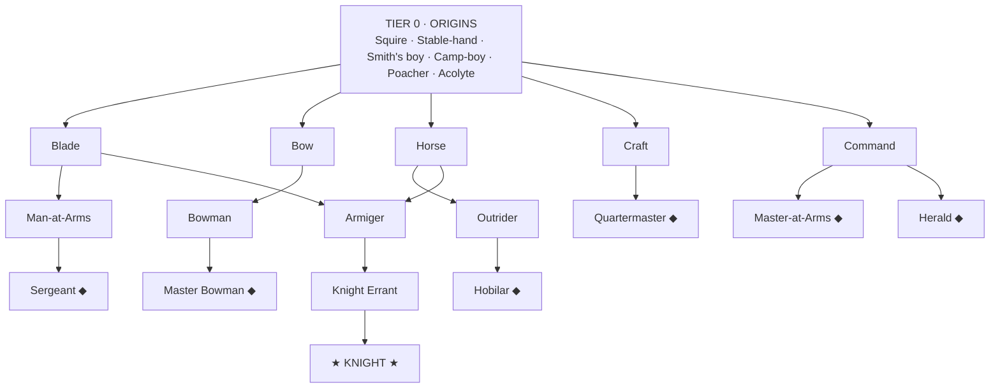

# Knight — Role Progression & Development Model

*Proposal v2, 2026-06-14. Design only — no code changes yet. Supersedes "start with 1 Knight + 3 Squires."*

> **Reading order:** §1 is the pitch. §2 is exactly how the current system works (with file refs) so we're arguing from facts. §3 is the proposed model. §4 is the visual. §5 is the three plans to choose between — the actual decision. §6 is what's left open.

---

## 1. Thesis

You do **not** start with a knight. You start with three plastic boys and one old man who has
already run the river. The game is the *forging* of a knight before the Grand Tournament — and
most runs you won't manage it. "Knight" names the game because it is the rarest thing in it:
a confluence of luck, survival, and the right grooves. **Original-XCOM, not new-XCOM** — nobody is
special at birth; survivors *become* legends by surviving. Staff is not a class you pick — it is
what a boy ages into when his body fails but his teaching stays sharp.

---

## 2. The current system (what we're actually changing)

### 2.1 "Role" is a two-value enum — shallow, and that's good news

`Unit.UnitClass { SQUIRE, KNIGHT }` (`unit.gd:8`), stored as `unit_class` (`unit.gd:22`), rendered
by `class_label()` (`unit.gd:97`). **Every consumer checks the attribute, never roster position**
(`unit_class == KNIGHT`) — so going from 2 roles to N is data-shallow. The blast radius is:

| Touches roles | Where | Effort |
|---|---|---|
| Enum + label | `unit.gd:8,22,97` | trivial |
| Save (one int) | `save_manager.gd:105,295` | trivial |
| Generation bands | `roster_generator.gd:11-23,70-112` | low |
| UI labels / honorific | `unit_card.gd:119`, `knight_overview.gd:91,345`, `formation_editor.gd:83` | low |
| Event scope `"knight"` | `story_event_db.gd:2569-2581` | medium |
| **Origin prose pools** (17 Knight / 15 Squire) | `chronicle.gd:513-556` | **high (content)** |
| **Combat** | `combat_unit.gd`, `combat.gd` | **none — stat-derived** |

The expensive part of touching roles is **narrative content**, not logic.

### 2.2 "Potential" is one hidden number — a total-stat budget

This is the FM "birth certificate" we dislike, and it's concrete:

- `potential_ability: int` per unit (`unit.gd:24`), rolled once: Knight **100–180**, Squire **60–140**
  (`roster_generator.gd:13-19`). Hidden from the player forever (GDD §10).
- It is a **budget on the sum of all 12 stats**: `try_increment` blocks any raise when
  `sum() + 1 > PA` (`stats.gd:130-137`).
- Growth *rate* tapers as `sum()` nears PA via one multiplier, `_headroom_factor` (`stats.gd:176-180`):
  full rate with ≥8 points of headroom, down to 12%, then 0 at PA.

### 2.3 The development engine is well-isolated (one factor does all the shaping)

`add_progress(stat, points, PA)` (`stats.gd:146-170`) is the whole staged-growth model:

```
accrued += (points / DEV_PACE) * _headroom_factor(PA)   # 4.5 wks/pt × a single 0..1 factor
```

Every gain in the game flows through here — training (`tick.gd:109`), the Determination bonus
(`tick.gd:128`), battle/duel/tournament rewards (`resolution.gd:542,585,620,714`), story events
(`story_event_db.gd:2749`). **Crucial for us: there is exactly one place where a shaping factor is
multiplied in.** Our proposed model swaps what that factor is made of — a contained change.

### 2.4 Roster size 4 is assumed in a handful of named spots

`roster_generator` (Knight id=1 + Squires 2–4), `knight_chooser`, `roster_view`, `pre_battle_review`,
`planning`, and a **hard `if roster.size() != 4` smoke-harness invariant** (`smoke_engine.gd:427`).
Maintenance cost already scales by `roster.size()` (`game_state.gd:149`). So a fixed-4 roster is cheap
to keep and only *moderately* expensive to make dynamic.

### 2.5 One-line verdict on embeddedness

> **Roles: shallow logic, heavy prose. Development: deep in one file, plus a save migration. Roster-size: a known short list.** Nothing here is a landmine — but the three concerns have very different costs, which is why the plans below isolate them.

---

## 3. The proposed model — three knobs replace one number

Kill the single hidden PA. Identity is **revealed and created by use** (Rimworld), with a *felt*
ceiling so units don't all drift toward competent-at-everything.

| Knob | What it is | Replaces / extends | Player feels |
|---|---|---|---|
| **Spark** | per-stat learning-*rate* mod. 1–2 **Spark** stats (×1.3), maybe one **Dull** (×0.7). Never a ceiling. | new; sits *inside* the `add_progress` factor | "takes to the bow like he was born to it" — flavour, found by doing |
| **Plasticity** | one per-unit multiplier on all gains, ~1.0 young → ~0.3 old; decays with weeks / age / injury | **replaces PA-headroom** as the soft ceiling | boys improve fast and broadly; old men are "set in their ways" |
| **Grooves** | repeated use of a stat cluster forms a **groove** (gains stay cheap); once settled, *off-groove* stats take **−50%** | new; this is the "potential reached" lock | identity hardens — a Sergeant can't cheaply retrain into a Herald |

New factor, same slot as `_headroom_factor`:

```
factor = plasticity  ×  spark[stat]  ×  groove_factor[stat]
```

- **No global PA budget** → no birth-certificate ceiling. (We can optionally retain a loose total
  cap for sanity; not required.)
- **Staff becomes emergent**: a unit at plasticity-floor whose only live groove is Care/Command is,
  mechanically and in fiction, a Master-at-Arms. Nothing to "build."
- **Spark without survival is nothing**: a blade Spark is worthless if the boy never lives to groove it.

Starting numbers to tune against the balance harness: plasticity 1.0 → 0.3 / career; Spark ×1.3 /
Dull ×0.7; off-groove ×0.5 once settled; settles after a run of consistent-groove weeks **or** a
defining event.

### Current → proposed, at a glance

| Concern | Current | Proposed |
|---|---|---|
| Role | binary enum `SQUIRE`/`KNIGHT` | tree of roles read off grooves + deeds |
| Potential | one hidden number; `sum() ≤ PA` | none — per-stat Spark + a Plasticity clock |
| Growth rate | `points/DEV_PACE × headroom(PA−sum)` | `… × plasticity × spark × groove` |
| Ceiling | hard sum cap | soft: plasticity decay + diminishing returns |
| The lock | none (just slows near PA) | grooves: −50% off-groove once settled |
| Start | 1 Knight (+flat bonus) + 3 Squires | 3 plastic boys + 1 downstream veteran |

---

## 4. The role river (primary visual — text, renders anywhere)

Many humble springs; tributaries that cross and merge; one rare sea. Origins only bias starting
Sparks — they are **not** destiny. `◆` = terminal (good, settled, stuck). The spine is pulled out
on its own line because it is the rare exception that must braid **two** grooves.

```
 TIER 0 · ORIGINS   — every boy starts here. high plasticity, no grooves, interchangeable, forgettable
     Squire · Stable-hand · Smith's boy · Camp-boy · Poacher · Acolyte
                                   │
                                   ▼   weeks of drill, fighting & surviving carve grooves
 TIER 1 · GROOVES   — identity emerges from what he actually does
     ┌──────────┬──────────┬──────────┬──────────┬───────────────┐
   Blade        Bow        Horse      Craft       Care / Command
     │           │          │          │            │
     ▼           ▼          ▼          ▼            ▼
 TIER 2 · TRADES   — settling begins: gains slow, off-groove locks at −50%
   Man-at-Arms   Bowman     Outrider   Quartermaster ◆   Master-at-Arms ◆
     │           │          │                            Herald ◆
     ▼           ▼          ▼
 TIER 3 · MASTERS  — terminal ◆ (strong, stuck — most boys end here)
   Sergeant ◆    Master     Hobilar ◆
                 Bowman ◆

 ════════════════════════════════════════════════════════════════════════════
 THE SPINE  — rare. must braid TWO grooves (Blade + Horse), then earn deeds:
     Blade + Horse ──►  ARMIGER  ──►  Knight Errant  ──►  ★ KNIGHT ★
                                                          the name. one, maybe none.
 ════════════════════════════════════════════════════════════════════════════
```

Three rules make it feel dynamic, not a flowchart:
1. **Convergence** — many reach a terminal `◆`; almost none braid two grooves to the sea.
2. **The lock is current direction** — grooves close the tributaries behind you (−50% off-groove);
   the river won't cheaply flow uphill.
3. **Settling can happen anywhere** — a boy can plateau as a fine Man-at-Arms for forty weeks and
   never move again. That dead water is the point.

<details><summary>Same diagram in Mermaid (for GitHub's renderer)</summary>


</details>

---

## 5. Three plans to choose between

They escalate in ambition and in how much of §2 they disturb. They roughly nest (B contains A's
role layer; C contains B), but each is a coherent stopping point.

### Plan A — "Titles" · light · ~1 sitting · low risk
**Idea:** ship the tree and the opening-pick reframe as a *labelling* layer over the **unchanged**
development engine. A unit's role is *derived* from its stat profile + milestones; PA and
`add_progress` are untouched.

- **Changes:** `unit.gd` enum → richer role (or computed role); `save_manager` int; `roster_generator`
  bands; new origin-prose pools (`chronicle.gd`); UI labels; opening pick = 1-of-3 veterans (reuse the
  Knight band, reframed). Optionally widen the `"knight"` event scope to "best/leader."
- **Leaves alone:** `stats.gd`, `tick.gd`, combat, roster size 4, balance.
- **Pro:** delivers the fiction + visible tree now; reproducibility and balance untouched; safe under
  the current content-freeze.
- **Con:** the lock/grooves are **cosmetic** — growth is still the single hidden PA budget you dislike.
  Honest, but it doesn't fix the model.

### Plan B — "Grooves replace PA" · medium · the real model · medium risk
**Idea:** the §3 three-knob rewrite. Roster stays 4.

- **Changes:** rebuild the one factor in `add_progress` to `plasticity × spark × groove`
  (`stats.gd`); add `spark`/`plasticity`/`grooves` fields to `Unit` + save migration (the
  established "missing key → default" pattern); roll Sparks in `roster_generator` (veterans start
  low-plasticity, locked); pass the unit (or new args) at the four `add_progress` call sites
  (`tick.gd`, `resolution.gd`, `story_event_db.gd`); reinterpret the two PA-delta event effects;
  derive roles from grooves (Plan A's label layer); new prose.
- **Watch:** **re-tunes all development balance** (`DEV_PACE` et al.) — wants the Phase-8d balance
  harness numbers first; **smoke determinism** — Sparks must be rolled through `RNG` so the replay
  check still passes (this net already caught a similar desync, per CLAUDE.md).
- **Pro:** this *is* the Rimworld-clean model; the lock is mechanical; staff becomes emergent.
- **Con:** balance reset + save migration + determinism care. Not freeze-safe until §4-harness exists.

### Plan C — "The river / lifecycle" · heavy · the full vision · high risk (≈ a new phase)
**Idea:** Plan B **plus** a living roster: origins/recruitment, aging, attrition/death (original-XCOM
pruning), retirement-into-staff, opening = 1-of-N origins.

- **Changes:** everything in B; make roster size **dynamic** — every spot in §2.4, including the hard
  `smoke_engine.gd:427` invariant and new recruitment/retirement UI flows; large origins-prose content;
  death/leave handling (epitaph machinery already exists in `chronicle.gd` — a real asset).
- **Pro:** every system pulls its weight; the Knight means everything because you can *fail to forge one*.
- **Con:** largest surface; disturbs roster invariants the smoke harness enforces; new UI; content-heavy;
  balance unknown. This is Phase 9, not a sprint.

### Recommendation

**Sequence A → B → C, deciding at each gate.** Do **A now** — it's freeze-safe, low-risk, and ships
the tree + the "forge a knight" reframe immediately. Do **B** once Phase-8d (the balance harness in
ROADMAP) produces development numbers to tune against — that's precisely the dependency B has. Treat
**C** as an explicit later phase. If you'd rather commit to the full philosophy up front and accept the
balance churn, we start at B and skip A's throwaway label scaffolding.

---

## 6. Open decisions (need your call for B/C)

1. **Spark vs blank slate** — keep a small innate birth Spark (replay texture, some boys just take to
   the blade), or go fully original-XCOM where everyone starts identical mud and only play carves them
   (purer thesis)?
2. **What settles a unit** — pure week-count, or gate it behind *defining events* (first kill, first
   rout, a maiming) so identity crystallizes from drama rather than a counter?
3. **Keep a loose total cap?** — drop the global budget entirely, or retain a soft sum ceiling as a
   sanity rail behind plasticity?
4. **Which plan** — A-now-then-B, or start at B?

---

*Once a plan and §6 are chosen: map the five grooves onto the 12 stats, set settle thresholds and the
plasticity curve, write the origin pools, and wire the opening pick into the Knight-chooser screen.*
