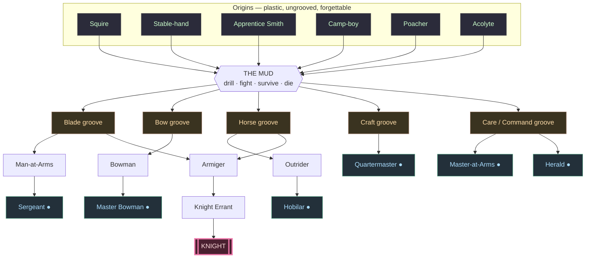

# Knight — Role Progression & Development Model

*Proposal, 2026-06-14. Design only — no code changes. Supersedes "start with 1 Knight + 3 Squires."*

## Thesis

You do **not** start with a knight. You start with three plastic boys and one old man who has
already run the river. The game is the *forging* of a knight before the Grand Tournament — and
most runs you won't manage it. "Knight" is the title of the game because it is the rarest thing
in it: the confluence of luck, survival, and the right grooves. Original-XCOM, not new-XCOM —
nobody is special at birth; the survivors *become* legends by surviving.

## 1. Development model — three knobs, no hidden PA

FM's single hidden Potential number is a birth certificate; we delete it. Identity is **revealed
and created by use**, the way Rimworld passions feel, but with a felt ceiling so units don't all
drift toward competent-at-everything.

| Knob | What it is | Source | Player feels |
|---|---|---|---|
| **Spark** | per-stat learning-*rate* mod, never a ceiling. 1–2 **Spark** stats (×1.3 gain), maybe one **Dull** (×0.7). | rolled at recruit, shown only as flavour | "takes to the bow like he was born to it" — discovered by doing |
| **Plasticity** | one per-unit multiplier on **all** gains: ~1.0 young → ~0.3 old, decays with weeks / age / injury | time and damage | boys improve fast and broadly; old men are "set in their ways" — a soft, asymptotic ceiling, never a wall |
| **Grooves** | train/fight a stat cluster repeatedly and it forms a **groove** (gains stay cheap). Once a unit has settled, *off-groove* stats take **−50%** gain. | play, repetition, defining events | identity hardens; this **is** the "potential reached" lock |

**Why three knobs, not one number:**
- *Staff is not a class.* A Master-at-Arms is just a unit whose body lost its plasticity but whose
  command/teaching groove stayed cheap. Boys **age into** staff; there is nothing to "build."
- *The ceiling is told as a story, not a stat.* "He's what he is now," not "PA 142."
- *Spark without survival is nothing.* A blade Spark amounts to zero if the boy never lives long
  enough to groove it.

Starting numbers (bolt onto `Stats.add_progress` / `DEV_PACE`): plasticity 1.0 → 0.3 per career;
Spark ×1.3 / Dull ×0.7; off-groove ×0.5 once settled; settles after a run of consistent groove
weeks **or** a crystallizing event.

## 2. The role river

Many humble springs, tributaries that cross and merge, narrowing to one rare sea. Origins only
bias your starting Sparks — they are **not** destiny. The apex needs **two** grooves braided
(arms **and** horse) plus deeds, so a Knight is a confluence, not a straight climb. `●` = terminal
(good, settled, stuck); `[[KNIGHT]]` = the sea — one, maybe none.

Three rules make it dynamic, not a flowchart:
1. **Convergence** — many reach a terminal `●`; almost none braid two grooves to the sea.
2. **The lock is current direction** — grooves close tributaries behind you (the −50%); the river
   won't cheaply flow uphill. A Sergeant can't be retrained into a Herald — he's downstream now.
3. **Settling can happen anywhere** — a boy can plateau as a perfectly good Man-at-Arms for forty
   weeks and never move again. That dead water is intended.

## 3. Roles at a glance

| Tier | Role | Groove | Note |
|---|---|---|---|
| Origin | Squire / Stable-hand / Apprentice Smith / Camp-boy / Poacher / Acolyte | none | plastic; biases Sparks only |
| Mid | Man-at-Arms · Bowman · Outrider | blade / bow / horse | the working body of the roster |
| Terminal | Sergeant · Master Bowman · Hobilar | as above | strong, settled, stuck |
| Terminal (support) | Quartermaster · Master-at-Arms · Herald | craft / command | what old or broken bodies become |
| Spine | Armiger → Knight Errant → **Knight** | blade **+** horse braided | rare; needs deeds, oath, house, kit |

## 4. The opening pick

Not a staff archetype — **the one man who has already run the river.** Mechanically identical to
the boys, just far downstream: plasticity nearly spent, grooves locked. Offer 3, pick 1 (mirrors
today's Knight chooser). Each is a strong floor with a permanent flaw, e.g. a faded **Disgraced
Knight** (best blade you'll have, but reputation-cursed), an old **Master-at-Arms** (can't carry a
fight, but trains the boys fast), a grey **Old Campaigner** (tactically priceless, body gone). He
buys the boys time to find out who — if anyone — has it. When his body finally fails, a good one
settles into a pure support groove and keeps teaching: the old man hangs up the sword and watches
the boy he raised get dubbed.

## 5. Open decisions

- **Spark vs blank slate** — keep a small innate birth Spark (replay texture), or go fully
  original-XCOM where everyone starts identical mud and only play carves them (purer thesis)?
- **What settles a unit** — pure week-count, or gate it behind *defining events* (first kill,
  first rout, a maiming) so identity crystallizes from drama rather than a counter?

---

*Once these two are answered: map grooves → the 12 stats, define settle thresholds, and wire the
opening pick into the Knight-chooser screen. No content/code lands until then.*
